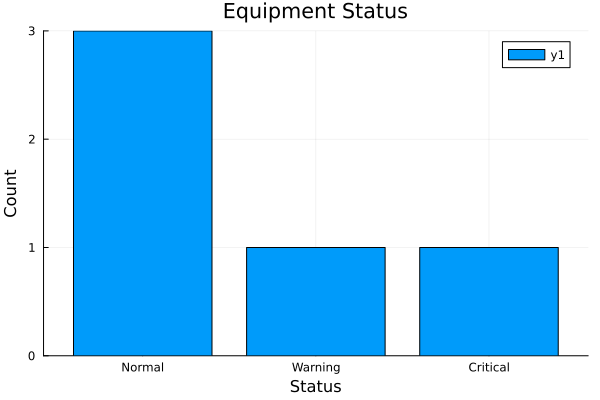
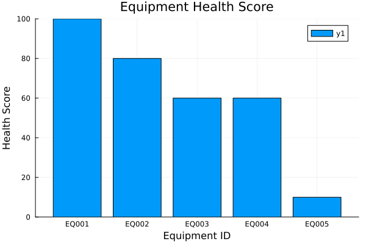
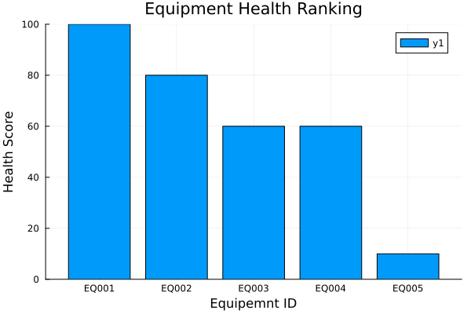
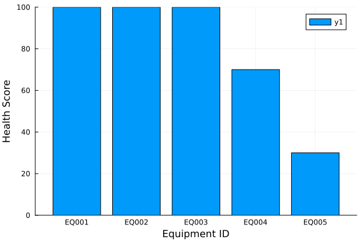

# Julia Learning for Semiconductor Data Analytics

This repository documents my Julia programming learning journey, focused on semiconductor equipment analytics, data analysis, visualization, risk assessment, and future machine learning projects.

## Career Target

Target roles:

- Algorithm Developer
- Data / AI Engineer for semiconductor manufacturing
- Computer Vision / Machine Learning Engineer

Target companies:

- Applied Materials (AMAT)
- ASML
- TSMC AI / ML related positions

## Learning Goals

- Build programming logic and data structure fundamentals
- Analyze CSV and tabular manufacturing data
- Practice statistical analysis and data visualization
- Simulate semiconductor equipment monitoring workflows
- Build rule-based equipment health, risk, and maintenance decision systems
- Prepare for Python, machine learning, computer vision, and semiconductor algorithm projects

## Progress

- [x] Day01 Variables
- [x] Day02 Arrays
- [x] Day03 Functions
- [x] Day04 Conditions
- [x] Day05 Loops
- [x] Day06 Dictionaries
- [x] Day07 Structs
- [x] Day08 CSV Files
- [x] Day09 DataFrames
- [x] Day10 Statistics
- [x] Day11 Visualization
- [x] Day12 Equipment Data Analysis
- [x] Day13 Equipment Dashboard Visualization
- [x] Day14 Equipment Trend Analysis
- [x] Day15 Equipment Anomaly Detection
- [x] Day16 Multi-Sensor Equipment Monitoring
- [x] Day17 Equipment Health Score System
- [x] Day18 Equipment Ranking Dashboard
- [x] Day19 Predictive Maintenance Dashboard
- [x] Day20 Equipment Risk Assessment System
- [ ] Day21 Equipment Risk Dashboard Visualization
- [ ] Future Project: Wafer Yield Analysis

## Latest Achievement

### Day20 - Equipment Risk Assessment System

Day20 converts equipment health information into risk scores, risk levels, maintenance actions, and equipment priority ranking.

Key results:

- Risk score calculation from health score
- Risk level classification: Low, Medium, High, Very High
- Maintenance action recommendation
- Equipment ranking by risk score
- Highest-risk equipment identification

## Current Portfolio Direction

The current project series simulates a simplified semiconductor equipment analytics workflow:

```text
Sensor Data
-> Equipment Status
-> Trend Analysis
-> Anomaly Detection
-> Multi-Sensor Monitoring
-> Health Score
-> Equipment Ranking
-> Predictive Maintenance Dashboard
-> Risk Assessment
-> Maintenance Action
```

This direction is relevant to semiconductor equipment monitoring, fault detection, maintenance prioritization, and predictive maintenance workflows.

## Repository Structure

| Path | Purpose |
|------|---------|
| `fundamentals/` | Day01-Day07 Julia syntax and data structure practice |
| `data_analysis/` | Day08-Day11 CSV, DataFrames, statistics, and visualization practice |
| `Projects/Day12_Equipment_Health_Dashboard/` | Equipment health classification project |
| `Projects/Day13_Equipment_Dashboard_Visualization/` | Dashboard-style equipment visualization project |
| `Projects/Day14_Equipment_Trend_Analysis/` | Time-series equipment trend analysis project |
| `Projects/Day15_Equipment_Anomaly_Detection_v1/` | Baseline-based anomaly detection project |
| `Projects/Day16_Multi_Sensor_Equipment_Monitoring/` | Multi-sensor equipment status monitoring project |
| `Projects/Day17_Equipment_Health_Score_System/` | Multi-sensor equipment health score project |
| `Projects/Day18＿Equipment＿Ranking＿Dashboard/` | Equipment ranking dashboard project |
| `Projects/Day19_Predictive_Maintenance_Dashboard/` | Predictive maintenance dashboard project |
| `Projects/Day20_Equipment_Risk_Assessment_System/` | Equipment risk assessment and maintenance action project |
| `Projects/Project01_Equipment_Health_Dashboard/` | Consolidated early dashboard project archive |
| `Career Goal.md` | Career roadmap toward semiconductor algorithm roles |
| `Project.toml` / `Manifest.toml` | Julia project dependencies |

## Project Overview

| Day | Project | Main Skill | Output |
|-----|---------|------------|--------|
| Day12 | Equipment Health Dashboard | Rule-based equipment status classification | DataFrame status report |
| Day13 | Equipment Dashboard Visualization | Dashboard chart generation | Five dashboard PNG charts |
| Day14 | Equipment Trend Analysis | Time-series trend monitoring | `temperature_trend.png` |
| Day15 | Equipment Anomaly Detection | Baseline-based anomaly detection | `equipment_anomaly.png` |
| Day16 | Multi-Sensor Equipment Monitoring | Temperature, pressure, and flow-rate classification | `equipment_status_summary.png` |
| Day17 | Equipment Health Score System | Multi-sensor KPI scoring | `equipment_health_score.png` |
| Day18 | Equipment Ranking Dashboard | Rank equipment by health score | `equipment_ranking.png` |
| Day19 | Predictive Maintenance Dashboard | Maintenance priority visualization | `predictive_maintenance_dashboard.png` |
| Day20 | Equipment Risk Assessment System | Risk scoring and maintenance action logic | Highest-risk equipment report |

## Selected Dashboard Outputs

### Day13 Equipment Status



### Day17 Equipment Health Score



### Day18 Equipment Ranking



### Day19 Predictive Maintenance Dashboard



## Day20 Risk Assessment Logic

Risk score formula:

```julia
risk_score = 100 - health_score
```

Risk level rules:

| Risk Score | Risk Level |
|------------|------------|
| >= 80 | Very High |
| >= 60 | High |
| >= 40 | Medium |
| < 40 | Low |

Maintenance actions:

| Risk Level | Action |
|------------|--------|
| Very High | Maintenance Immediately |
| High | Maintenance Within 7 Days |
| Medium | Operation Monitoring |
| Low | Normal Operation |

## Skills Demonstrated

- Julia programming fundamentals
- CSV data loading
- DataFrame-based data processing
- Custom function design
- Rule-based equipment status classification
- Statistical aggregation with `groupby()` and `combine()`
- Data visualization with Plots.jl
- Chart export with `savefig()`
- Health score and risk score design
- Equipment ranking and maintenance prioritization
- Semiconductor equipment analytics thinking

## Technologies Used

- Julia
- CSV.jl
- DataFrames.jl
- Statistics.jl
- Plots.jl

## How to Run

Install dependencies:

```bash
julia --project=. -e 'using Pkg; Pkg.instantiate()'
```

Run Day12 equipment health analysis:

```bash
julia --project=. "Projects/Day12_Equipment_Health_Dashboard/Day12_Equipment_Data_Analysis_Project_V1.jl"
```

Run Day13 dashboard visualization:

```bash
julia --project=. "Projects/Day13_Equipment_Dashboard_Visualization/Day13_Equipment_Dashboard_Visualization.jl"
```

Run Day14 trend analysis:

```bash
julia --project=. "Projects/Day14_Equipment_Trend_Analysis/Day14_Equipment_Trend_Analysis.jl"
```

Run Day15 anomaly detection:

```bash
julia --project=. "Projects/Day15_Equipment_Anomaly_Detection_v1/Day15_Equipment_Anomaly_Detection_v1.jl"
```

Run Day16 multi-sensor monitoring:

```bash
julia --project=. "Projects/Day16_Multi_Sensor_Equipment_Monitoring/Day16_Multi_Sensor_Equipment_Monitoring.jl"
```

Run Day17 health score system:

```bash
julia --project=. "Projects/Day17_Equipment_Health_Score_System/Day17_Equipment_Health_Score_System.jl"
```

Run Day18 equipment ranking dashboard:

```bash
julia --project=. "Projects/Day18＿Equipment＿Ranking＿Dashboard/Day18_Equipment_Ranking_Dashboard.jl"
```

Run Day19 predictive maintenance dashboard:

```bash
julia --project=. "Projects/Day19_Predictive_Maintenance_Dashboard/Day19_Predictive_Maintenance-Dashboard.jl"
```

Run Day20 risk assessment system:

```bash
julia --project=. "Projects/Day20_Equipment_Risk_Assessment_System/Day20_Equipment_Risk_Assessment_System.jl"
```

## Roadmap

Completed:

1. Julia fundamentals
2. CSV and DataFrames
3. Statistics and visualization
4. Equipment health classification
5. Equipment dashboard visualization
6. Equipment trend analysis
7. Equipment anomaly detection
8. Multi-sensor equipment monitoring
9. Equipment health score system
10. Equipment ranking dashboard
11. Predictive maintenance dashboard
12. Equipment risk assessment system

Next:

13. Equipment Risk Dashboard Visualization
    - Risk distribution chart
    - Risk level summary chart
    - Maintenance action dashboard
    - Highest-risk equipment highlight

Future:

14. Wafer Yield Analysis
    - Lot-level and wafer-level yield data
    - Correlation analysis
    - Yield loss investigation

15. Computer Vision Defect Detection
    - Python and OpenCV
    - Defect image preprocessing
    - Basic classification or detection workflow

## Long-Term Direction

Julia -> Python -> Data Analysis -> Machine Learning -> Computer Vision -> Semiconductor Algorithm Projects

## Author

Wei Wang

Learning project for semiconductor equipment data analytics.
