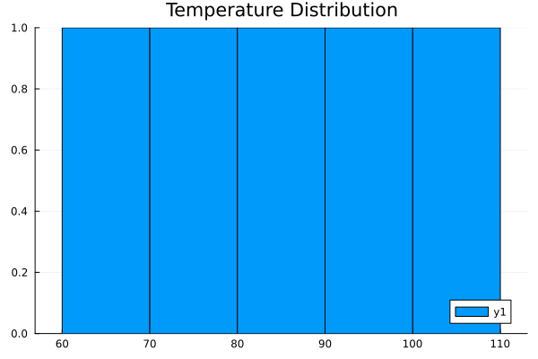
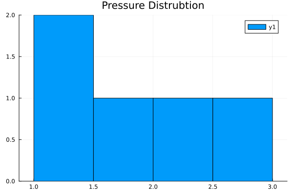
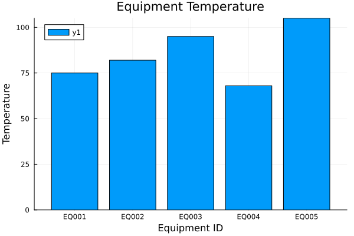
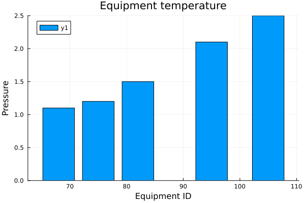

# Julia Learning for Semiconductor Data Analytics

This repository documents my Julia programming learning journey, focused on building the foundation for semiconductor equipment analytics, data analysis, visualization, and future machine learning projects.

## Career Target

Target roles:

- Algorithm Developer
- Data / AI Engineer for semiconductor manufacturing
- Computer Vision / Machine Learning Engineer

Target companies:

- Applied Materials (AMAT)
- ASML
- TSMC AI / ML related positions

## Learning Goals

- Build programming logic and data structure fundamentals
- Analyze CSV and tabular manufacturing data
- Practice statistical analysis and data visualization
- Simulate semiconductor equipment monitoring workflows
- Prepare for Python, machine learning, computer vision, and semiconductor algorithm projects

## Progress

- [x] Day01 Variables
- [x] Day02 Arrays
- [x] Day03 Functions
- [x] Day04 Conditions
- [x] Day05 Loops
- [x] Day06 Dictionaries
- [x] Day07 Structs
- [x] Day08 CSV Files
- [x] Day09 DataFrames
- [x] Day10 Statistics
- [x] Day11 Visualization
- [x] Day12 Equipment Data Analysis
- [x] Day13 Equipment Dashboard Visualization
- [x] Day14 Equipment Trend Analysis
- [x] Day15 Equipment Anomaly Detection
- [x] Day16 Multi-Sensor Equipment Monitoring
- [x] Day17 Equipment Health Score System
- [ ] Future Project: Wafer Yield Analysis

## Latest Achievement

### Day17 - Equipment Health Score System

Day17 builds a multi-sensor health score system for equipment monitoring.

Generated results:

- Health score calculation from temperature, pressure, and flow rate
- Health level classification: Excellent, Good, Warning, Critical
- Equipment health score chart

## Current Project: Equipment Health Dashboard

This project simulates a simplified semiconductor equipment monitoring system.

The system analyzes equipment operating parameters and classifies equipment health status as:

- Normal
- Warning
- Critical

## Dataset

Input file:

```text
equipment_data.csv
```

Columns:

| Column | Description |
|--------|-------------|
| `equipment_id` | Equipment ID |
| `temperature` | Equipment temperature |
| `pressure` | Equipment pressure |
| `flow_rate` | Equipment flow rate |

Example:

| equipment_id | temperature | pressure | flow_rate |
|--------------|-------------|----------|-----------|
| EQ001 | 75 | 1.2 | 100 |
| EQ002 | 82 | 1.5 | 95 |
| EQ003 | 95 | 2.1 | 80 |
| EQ004 | 68 | 1.1 | 105 |
| EQ005 | 105 | 2.5 | 70 |

## Equipment Status Rules

Critical:

- Temperature > 100
- OR pressure > 2.3

Warning:

- Temperature > 85
- OR pressure > 1.8

Normal:

- All other conditions

## Example Logic

```julia
function check_status(temp, pressure)
    if temp > 100 || pressure > 2.3
        return "Critical"
    elseif temp > 85 || pressure > 1.8
        return "Warning"
    else
        return "Normal"
    end
end
```

## Dashboard Outputs

### Temperature Distribution



### Pressure Distribution



### Equipment Status


### Equipment Temperature



### Equipment Pressure



## Repository Structure

| File | Purpose |
|------|---------|
| `LearningLog.md` | Main learning notes and progress tracking |
| `Career Goal.md` | Career roadmap toward semiconductor algorithm roles |
| `equipment.csv` | Early sample equipment monitoring dataset |
| `equipment_data.csv` | Day12-Day13 equipment dashboard dataset |
| `Day01-Variables.jl` - `Day07-Structs.jl` | Julia fundamentals |
| `Day08-CSV-Files.jl` | CSV loading and equipment alarm logic |
| `Day09-DataFrames.jl` | DataFrame analysis and alarm detection |
| `Day10-Statistics.jl` | Statistical analysis for equipment data |
| `Day11-Visualizations.jl` | Basic equipment health visualization |
| `Day12-Equipment Data Analysis Project V1.jl` | Equipment health classification project |
| `Day13-Equipment-Dashboard-Visualization.jl` | Dashboard chart generation |
| `Learning_Log_Day12.md` | Day12 project learning log |
| `Learning _Log_Day13.md` | Day13 project learning log |
| `Equipment Dashboard Visualization.md` | Day13 project documentation |
| `Project.toml` / `Manifest.toml` | Julia project dependencies |

## Skills Demonstrated

- Julia programming fundamentals
- CSV data loading
- DataFrame-based data processing
- Custom function design
- Equipment status classification
- Statistical aggregation with `groupby()` and `combine()`
- Data visualization with Plots.jl
- Chart export with `savefig()`
- Semiconductor equipment analytics thinking

## Technologies Used

- Julia
- CSV.jl
- DataFrames.jl
- Statistics.jl
- Plots.jl

## How to Run

Install dependencies:

```bash
julia --project=. -e 'using Pkg; Pkg.instantiate()'
```

Run Day12 equipment health analysis:

```bash
julia --project=. "Day12-Equipment Data Analysis Project V1.jl"
```

Run Day13 dashboard visualization:

```bash
julia --project=. Day13-Equipment-Dashboard-Visualization.jl
```

## Roadmap

Current focus:

1. Equipment Health Analysis
   - Equipment status classification
   - Critical equipment detection
   - Summary statistics

2. Equipment Dashboard Visualization
   - Temperature and pressure distribution
   - Status summary chart
   - Equipment comparison charts

Completed:

3. Equipment Trend Analysis
   - Time-series equipment data
   - Trend visualization
   - Early warning detection

4. Equipment Anomaly Detection
   - Baseline calculation
   - Threshold-based anomaly detection
   - Abnormal equipment filtering

5. Multi-Sensor Equipment Monitoring
   - Temperature, pressure, and flow rate analysis
   - Normal, Warning, and Critical classification
   - Equipment status summary visualization

6. Equipment Health Score System
   - Health score calculation
   - Health level classification
   - Equipment KPI foundation

Next:

7. Equipment Ranking Dashboard
   - Rank equipment by health score
   - Highlight high-risk equipment
   - Prioritize maintenance actions

Future:

8. Predictive Maintenance
   - Fault indicators
   - Maintenance risk scoring
   - Basic anomaly detection

9. Wafer Yield Analysis
   - Lot-level and wafer-level yield data
   - Correlation analysis
   - Yield loss investigation

10. Computer Vision Defect Detection
   - Python and OpenCV
   - Defect image preprocessing
   - Basic classification or detection workflow

## Long-Term Direction

Julia -> Python -> Data Analysis -> Machine Learning -> Computer Vision -> Semiconductor Algorithm Projects

## Author

Wei Wang

Learning project for semiconductor equipment data analytics.
